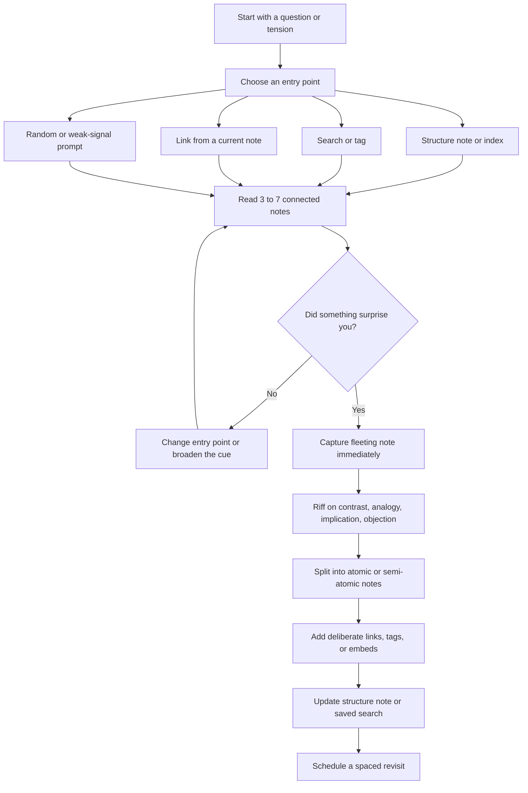

# Navigating a Zettelkasten to Surface New Ideas

## Executive summary

A Zettelkasten is most useful when you treat it not as a filing cabinet to be “looked up,” but as a thinking environment to be *traversed*. The strongest online explanations converge on the same point: a Zettelkasten is a personal tool for thinking and writing, built as a *web of thoughts* rather than a mere collection of notes. Luhmann’s own description goes further: the slip-box becomes a “communication partner” precisely because it can surprise you, offer non-obvious connections, and make more information available during retrieval than you explicitly stored in any single note.

That has an important practical consequence. “Reading through” a Zettelkasten should have several goals at once: re-orienting yourself, recovering forgotten context, finding promising tensions, testing a question against existing notes, and recombining ideas into draftable arguments. Search is necessary, but search alone is not enough. Explicit links make certain paths easier to follow, structure notes act like personal tables of contents, and keyword indexes or tags remain useful as entry points rather than final destinations.

The cognitive case for this style of navigation is strong. Serendipity research describes idea discovery as encountering pertinent information when you were not looking for *exactly that*; associative memory research models retrieval as spreading activation in a network; and reviews of spaced and distributed retrieval show that revisiting material over time improves long-term retention and transfer. In a Zettelkasten, those three principles map cleanly to exploration, link-following, and scheduled revisits.

The most productive operating pattern is therefore a loop: start from a good entry point, read a short chain of connected notes, capture any surprise or tension immediately, split and recombine ideas atomically, then leave behind a better path than the one you found. In practice, that means alternating between strong signals such as links and structure notes, and weak signals such as tags, search results, or random prompts. Software matters, but less than the habit: Obsidian, Logseq, Zettlr, and The Archive all provide mechanisms for entering the network, filtering it, and preserving improved paths for later return.

## Goals of navigating a Zettelkasten

The first goal is **orientation**. In a small archive, full-text search and tags may be enough; in a larger one, they stop being sufficient on their own because they return undifferentiated sets of notes. Structure notes emerge precisely when “a couple hundred notes” under one tag become too much to mentally hold. They act as curated entry points and reduce the cost of re-entering a topic.

The second goal is **retrieval with context**. Luhmann argued against rigid topical placement because fixed topical order locks you into a single structure too early. Instead, he combined fixed placement, internal branching, cross-references, and a keyword index so that a note could be reached from multiple contexts. In modern terms, the point is not only to find a note, but to find the *thread* it belongs to.

The third goal is **recombination**. Christian Tietze’s early workflow note is still one of the clearest statements of why atomicity matters: separate concerns enough that notes can be reused in new arguments, but keep together what genuinely belongs together. He explicitly ties atomicity to re-use and increased connections in the network. That is the mechanism by which a reading session becomes an idea session.

The fourth goal is **writing preparation**. Ahrens-oriented workflows described on zettelkasten.de move from fleeting notes to literature notes to self-contained permanent notes, but the key practical point is simpler: reading notes are not the final product; they are feedstock for notes that can stand on their own and be drafted from later. Even the more sceptical community guidance on “permanent notes” converges on one useful formulation: aim for notes that are *permanently useful*, not permanently frozen.

The fifth goal is **surprise**. Luhmann’s “communication partner” idea is not mystical. It means a good Zettelkasten should sometimes return something useful but not fully predicted, because its internal comparison schemes differ from what is currently top-of-mind. That is why navigation should leave room for controlled randomness and heterogeneity, not only exact lookup.

## Cognitive principles that make navigation generative

Serendipity is best understood as *pertinent chance encounter*. Agarwal’s review distinguishes serendipitous discovery from purposive information-seeking and frames it as encountering or stumbling upon relevant information when not directly looking for it, or while looking for something else. That is exactly why a Zettelkasten should sometimes be explored through side doors rather than direct search. If every session begins and ends with a single precise keyword query, you reduce the chance of idea-bearing surprise.

Associative search works because memory is networked. Anderson’s classic spreading-activation account describes retrieval as activation spreading through an interconnected network. Luhmann says something strikingly similar in practical rather than experimental language: retrieval should activate an internal network of connections, and under the right search impulse it can yield more information than expected. A good note-navigation session therefore uses partial cues, neighbouring notes, aliases, tags, and cross-links to activate a region rather than a single point.

Creativity benefits from remote association and recombination. Contemporary open-access work links learning and creativity through associative thinking, while older creativity theory still frames creative thought as forming associative elements into new combinations. In Zettelkasten practice, that translates into deliberately reading across heterogeneous clusters, searching problem statements rather than just topics, and putting concept notes beside examples, objections, definitions, and analogies.

Spaced review matters because the archive is only useful if it remains cognitively available. Reviews of distributed and retrieval practice consistently find advantages over massed study, including better retention and transfer. In note-work, this does **not** mean re-reading the whole archive. It means scheduling periodic, small revisit sessions so that older notes re-enter working memory and can be linked to current projects. The highest-yield sessions are usually short, frequent, and cue-rich.

A practical synthesis is to alternate **exploitation** and **exploration**. Exploitation follows strong paths you already trust: structure notes, backlinks, direct links, project hubs. Exploration uses weaker or noisier paths: broad search, tags, related-file rankings, graph depth, or random-note prompts. The alternation keeps navigation both efficient and idea-generative. This is an inference from the way Luhmann builds surprise into the system, the way structure notes add guided access, and the way search alone becomes too flat at scale.

This loop reflects the strongest cross-source pattern: use entry points to activate a region, capture surprise fast, and leave the archive easier to re-enter next time than it was before.

## Practical navigation techniques

The most reliable technique is the **guided link walk**. Start from one note that is already relevant, then follow only the links that answer one of four prompts: “supports,” “contradicts,” “defines,” or “extends.” This keeps you from mindless clicking while still exploiting the network. The justification is simple: explicit links are worth making because they create usable paths, and those paths reduce the cost of future interpretation.

A second technique is the **tag walk**. Tags are weak but useful entrance cues. Sascha Fast notes that tags are important entrances in smaller archives, while Zettlr explicitly treats tagging as a horizontal, non-hierarchical sorting system. Use tags to gather a swarm, then immediately refine into a better path: save a search, create a structure note, or add missing direct links between the best notes in the result set.

A third technique is the **structure-note walk**. Structure notes are the most dependable way to re-enter a mature archive because they add order to a set, like a table of contents made for your own purposes. Logseq’s “Contents” page is a lightweight example; Fast’s structure-note essay explains why these notes become increasingly valuable as note volume rises. If you know the neighbourhood but not the exact destination, start here.

A fourth technique is the **index-to-branch walk**. Luhmann’s design couples a keyword index to internal branching. The modern equivalent is: search or index into a concept, then traverse into branches and cross-references, not just sibling results. This is more generative than opening isolated search hits one by one because it follows the archive’s own associative structure.

A fifth technique is the **random walk with a constraint**. Randomness is useful only when bounded. Luhmann explicitly says surprise requires randomness built into the system, but he pairs that with internal connection opportunities and problem statements that relate heterogeneous concepts. So do not open a random note and hope. Open a random note and ask one question: “What current problem could this sharpen, challenge, or analogise?”

A sixth technique is the **graph-view check**, used sparingly. Graph views are usually poor *primary* reading interfaces but good *secondary* ones. Obsidian’s local graph lets you adjust depth around the active note; that makes it more actionable than a global hairball because it narrows attention to a region. The practical rule is: use graph views to choose a next step, not to think inside the graph itself. That recommendation is partly an inference from the local-depth design.

A seventh technique is **query-driven navigation**. Obsidian search operators, Logseq advanced queries, The Archive’s boolean search, and Zettlr’s global full-text search all support more than plain keyword recall. The high-yield pattern is to search for a *tension* rather than a topic: for example, concept A plus concept B, or concept A but not its usual companion, or a phrase plus a tag indicating uncertainty or incompleteness. The Archive explicitly supports `AND`, `OR`, and `NOT`; Obsidian supports search operators and embedded search results; Logseq supports advanced queries with block/page inputs; Zettlr supports global full-text search across workspaces.

An eighth technique is **transclusion or embedded reading**. When a tool supports embeds, use them to keep context visible while you think. Obsidian allows embedding linked content and even embedded search results; Logseq supports embeds and query blocks; Zettlr does not foreground transclusion in the same way, but its split view and related-files sidebar achieve a similar reduction in context switching. Embedding is particularly useful for structure notes, where you want to see summary and detail together.

| Technique | Best goal | Effort | Expected outcome |
|---|---|---:|---|
| Guided link walk | Deepen one line of thought | Low | Better argument structure, missing-link discovery |
| Tag walk | Re-enter a broad topic | Low | Cluster discovery, candidate notes for curation |
| Structure-note walk | Regain overview in a large archive | Medium | Faster orientation, reusable entry point |
| Index-to-branch walk | Explore multiple contexts of one idea | Medium | Cross-context retrieval, better branching |
| Random walk with a constraint | Force serendipity | Low | Unexpected analogy, objection, or example |
| Graph-view check | Pick a promising next note | Low | Regional awareness, next-step choice |
| Query-driven navigation | Surface tensions and edge cases | Medium | Non-obvious combinations, contradiction hunts |
| Transclusion or embedded reading | Compare summary and detail in one place | Medium | Lower context-switch cost, easier synthesis |

This comparison synthesizes the behavioural advice in Luhmann, zettelkasten.de practice guides, and the relevant software documentation.

## Workflows for idea generation while reading

A practical reading workflow begins with **capture**, but capture is not enough. Tietze’s old but still useful process is “collect, process, and write.” In his atomicity workflow, the important middle move is clustering: do not convert every reading mark directly into a standalone note. First cluster the material around what you were trying to understand, then write overview notes and branch detail notes from there.

The next move is **riffing**. After opening a note or cluster, add one short scratch block answering one of these prompts: “What does this imply?”, “What does this contradict?”, “Where else does this pattern appear?”, or “What assumption makes this work?” This is how an archive stops being merely referential and starts becoming generative. Luhmann’s own advice to search for problem statements that relate heterogeneous concepts is the best theoretical justification for this step.

Then comes **atomic recombination**. Tietze’s best formulation is not “one idea per note” in a rigid sense. It is: keep together what belongs together, but separate concerns so that parts can be reused. Start with the most general note per cluster, branch into details where prerequisites accumulate, then feed the useful detail back into the overview. That pattern gives you notes that can later be recombined without losing their bearings.

For **literature notes versus permanent notes**, the most useful analytical stance is flexible but distinct. The Ahrens-oriented explainer on zettelkasten.de treats literature notes as source references and attached source-context notes, while zettels are self-contained permanent notes in the slip-box. At the same time, zettelkasten.de’s discussion of “permanent” warns against fetishising fixed note types; the real aim is permanently useful notes that can still be revised. In practice, that means source notes answer “what did this source say?”, while permanent notes answer “what do I now think is worth keeping and linking?”

Here are three example sessions that operationalise those principles.

**Creative brainstorming session**

1. **Minutes 0–5:** Start from a structure note or broad tag relevant to your theme. Open three notes that feel central, then one note that feels marginal. Your job is not to summarize; it is to find one productive discontinuity.  
2. **Minutes 5–12:** Follow one strong link chain for depth, then one weak cue chain via a tag or broad search term for breadth. Write a fleeting note whenever you notice a contrast, analogy, or missing bridge.  
3. **Minutes 12–20:** Turn the best fleeting note into one overview note and two branching notes: one definition/example note, one implication/objection note. Link them back to the original cluster.  
4. **Minutes 20–25:** Update the structure note or save a search so this new cluster has a stable return path.

**Research synthesis session**

1. **Minutes 0–10:** Open literature notes or source-linked notes for one paper/book and cluster them by question rather than by chapter order. Tietze explicitly recommends clustering orthogonally to the text’s sequence if that better captures your purpose.  
2. **Minutes 10–20:** For each cluster, draft one self-contained synthesis note in your own words. If a point needs too many prerequisites, split those prerequisites into separate branch notes.  
3. **Minutes 20–30:** Search your archive for prior notes that either use similar concepts or challenge the cluster. Prefer heterogeneous pairings rather than close paraphrases.  
4. **Minutes 30–35:** Add direct links from the new synthesis note to one supporting note, one contrasting note, and one example note. That triangular pattern is often enough to make the note re-usable in future writing.

**Problem-solving session**

1. **Minutes 0–5:** Phrase the problem as a tension, not a noun. For example: “How can X scale without losing Y?” This improves search and increases the chance of useful remote associations.  
2. **Minutes 5–12:** Search for both exact terms and adjacent concepts. Use boolean or operator-based search where available. Open notes that mention one side of the tension but not the other.  
3. **Minutes 12–20:** Read outward through backlinks, outgoing links, related files, or block references. Stop after six notes even if more look promising. The point is activation, not exhaustive review.  
4. **Minutes 20–30:** Draft a solution note with three sections only: candidate answer, assumptions, failure modes. Then link each section to one prior note. This turns abstract problem-solving into reusable local structure.  
5. **Minutes 30–35:** Schedule a spaced revisit in a few days and leave a search, structure note, or work queue tag pointing back to this cluster. Spaced revisits improve retention and often improve solutions because the second session starts from a richer network state.

## Software affordances and shortcuts

The right software feature is whichever one lowers the cost of entering, narrowing, and preserving a path through the network. The table below focuses on four widely used tools with publicly accessible documentation.

| Tool | Navigation features that materially help idea discovery | Useful shortcuts and commands |
|---|---|---|
| **Obsidian** | Backlinks surface incoming context; Outgoing Links shows existing and potential links; Search supports operators and embedded search results; Internal links auto-update on rename; Local Graph view lets you inspect a note’s neighbourhood by depth; hotkeys are fully customisable. | `Ctrl/Cmd+O` Quick Switcher; `Ctrl/Cmd+P` Command Palette; `Ctrl/Cmd+Shift+F` Search. Use Command Palette to expose backlink-related commands and assign your own hotkeys. |
| **Logseq** | Block-based navigation makes even small units addressable; page refs and block refs support associative traversal; the Contents page acts as a lightweight index/structure note in the right sidebar; advanced queries support page/block-aware inputs, which makes targeted retrieval powerful in large graphs. | `Ctrl/Cmd+U` Search entry; `/` command menu; `[[` page reference/create page; `((` block reference; `Tab` / `Shift+Tab` indent and unindent; `Enter` new block; `Shift+Enter` new line within block. |
| **Zettlr** | Built-in Zettelkasten mode explicitly centres IDs, links, and tags; Related Files ranks explicit links above mere keyword overlap; global full-text search spans all open workspaces; sidebar includes table of contents, references, related files, and assets; tags are first-class for horizontal sorting. | `Cmd/Ctrl+Shift+F` Global Search; `Cmd/Ctrl+F` in-file search; `Cmd/Ctrl+L` insert Zettelkasten ID; `Cmd/Ctrl+Shift+L` copy current ID; `Cmd/Ctrl+K` insert link. |
| **The Archive** | Omnibar-centred navigation is extremely fast for search-driven traversal; boolean search supports `AND`, `OR`, and `NOT`; wiki links can act as clickable saved searches; clicking tags and wiki links rewrites the Omnibar context; external `thearchive://match/TERM` links make note IDs durable entry points from other apps. | `⌘L` focus Omnibar; `Tab` jump from Omnibar to editor when a note is selected; arrow keys move through results; `Esc` clears search; `⌘Backspace` deletes the selected note from Omnibar context. Custom shortcuts can be assigned through macOS menu shortcut mechanisms. |

A practical recommendation follows from these affordances. If you often think through *notes*, favour tools with strong backlinks, local graph, and embeds. If you think through *blocks*, Logseq’s block references and block-aware queries are unusually good. If you prefer a text-file-first academic workflow, Zettlr’s global search, IDs, and related-files logic are especially strong. If you want speed and deliberate minimalism, The Archive’s Omnibar and saved-search idioms are hard to beat. That is a synthesis of the documented feature sets above, not a benchmark claim.

## Prioritised online sources and limitations

If you want to build a rigorous reading practice around your own archive, prioritize sources in this order.

**Start here for method and theory**

- **Niklas Luhmann, “Communications with Zettelkastens”** in the improved English translation on zettelkasten.de. It is the best publicly accessible source on why surprise, branching, cross-reference, and indexing matter.
- **Introduction to the Zettelkasten Method** on zettelkasten.de. Concise and still one of the clearest high-level definitions.
- **A Tale of Complexity – Structural Layers in Note Taking** on zettelkasten.de. Best online explanation of why structure notes become necessary as note volume rises.

**Use these for Ahrens-oriented workflow**

- **From Fleeting Notes to Project Notes** on zettelkasten.de. Best online unpacking of Ahrens’s note categories and workflow, especially if you want a clean distinction among fleeting, literature, and permanent notes.
- **Create Zettel from Reading Notes According to the Principle of Atomicity** for the still-useful “cluster, then overview, then branch” workflow. Read it with the 2025 caveat that “atomicity” should not be turned into dogma.
- **All notes are malleable** for a corrective against over-rigid note taxonomies. Useful when “permanent note” thinking becomes paralyzing.

**Then map the method into your software**

- **Obsidian Help**: Backlinks, Search, Quick Switcher, Command Palette, Internal Links, Graph view, and Hotkeys. These are the core plugin docs most relevant to navigation.
- **Zettlr User Manual**: Zettelkasten Methods, Related Files, Tag Manager, Global Search, Keyboard Shortcuts, and First Steps. This set covers nearly the full navigation stack.
- **Logseq documentation**: use the public community mirror for basic navigation pages and the official GitHub docs for advanced queries and DB-graph details.
- **The Archive Help**, **Review Tips**, and **wiki-links-as-searches**. These are unusually good for understanding minimalist, search-first navigation.

**Use cognitive science to refine the habit**

- Agarwal on serendipity in information behaviour.
- Anderson on spreading activation and networked retrieval.
- Reviews of distributed and retrieval practice.

A few limitations matter. First, the most important Ahrens source remains a book, so the best online material is interpretive rather than a full free primary text. Second, publicly accessible Logseq documentation is fragmented between a community-maintained mirror and official GitHub pages, so details may lag interface changes. Third, shortcuts are platform-sensitive and often customisable, especially in Obsidian and macOS-based workflows such as The Archive, so treat defaults as starting points and then standardize your own navigation layer.

The practical bottom line is straightforward: the best way to read a Zettelkasten for new ideas is to enter through a curated doorway, follow a short chain, capture surprise fast, split and recombine ideas into reusable notes, and then leave behind a better doorway than the one you used. If you repeat that loop, your archive becomes easier to navigate *and* more capable of giving you thoughts you would not have had by rereading your sources alone.